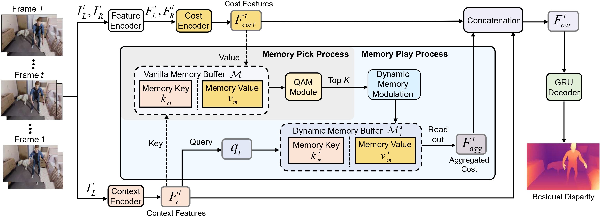
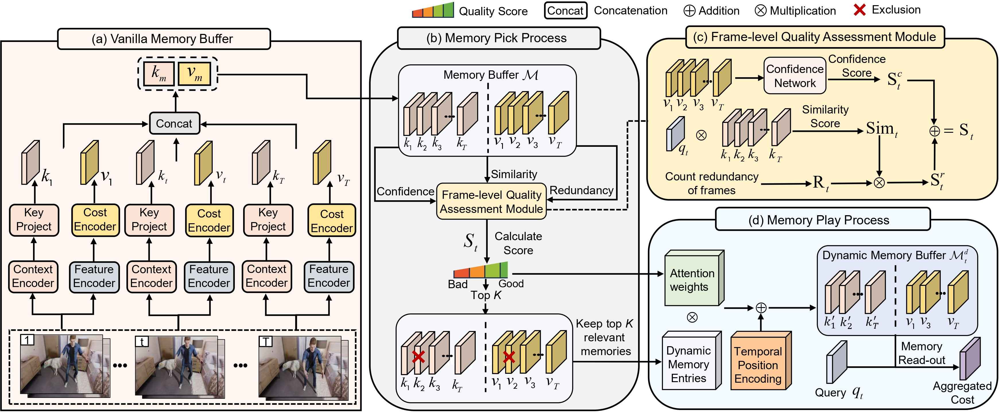

# 💥[NeurIPS 2025] PPMStereo: Pick-and-Play Memory Construction for Consistent Dynamic Stereo Matching

**City University of Hong Kong**

Yun Wang, Junjie Hu, Qiaole Dong, Yongjian Zhang, Yanwei Fu, Tin Lun Lam, Dapeng Wu

> **Status:** Accepted at NeurIPS 2025 (poster).

[**Paper**](#) · [**Project Page**](#) · [**BibTeX**](#citing-ppmstereo)

---
## 🌟 Demo Visualization
<p align="center">
  
  
</p>


## 😊 Overview

**PPMStereo** tackles temporally consistent depth estimation from **stereo videos**. The core idea is a **Pick-and-Play Memory (PPM)** module that first **picks** high-quality reference frames and then **plays** (re-weights) them for aggregation, yielding a **compact yet informative** temporal memory. This design maintains **long-range spatio-temporal consistency** while keeping computation tractable. Experiments on **SceneFlow**, **Dynamic Replica**, **Sintel**, and more show state-of-the-art accuracy and temporal stability with a favorable efficiency–accuracy trade-off.


---

## 😘 What’s New in PPMStereo

- **Pick-and-Play Memory (PPM):**  
  - **Pick:** via a **Quality Assessment Module (QAM)** to select reliable, non-redundant references.  
  - **Play:** query-adaptive weighting to aggregate selected frames for robust cost refinement.  
- **Long-range consistency** with a **compact dynamic buffer**, avoiding costly computation.  
- **Strong results** and **efficiency** under fewer RAFT-style iterations while maintaining accuracy.
---

## 👉 Framework
<p>
  
   
</p>


## Dataset: Dynamic Replica

Download `links.json` from the project site’s *data* tab (after accepting the license). Place it in the project root and run:

```bash
git clone https://github.com/facebookresearch/dynamic_stereo
cd dynamic_stereo
export PYTHONPATH="$(cd .. && pwd):$(pwd):$PYTHONPATH"

python ./scripts/download_dynamic_replica.py --link_list_file links.json \
  --download_folder /data/ywang/dataset/ \
  --download_splits real valid test train
```

**Approximate storage after unpacking (with annotations):**

- `train` ≈ 1.8T  
- `test` ≈ 328G  
- `valid` ≈ 106G  
- `real` ≈ 152M

(You can use the official PyTorch dataset class: `datasets/dynamic_stereo_datasets.py`.)

---

## Installation

> Tested with **PyTorch 1.12.1 + CUDA 11.x**. Ensure your CUDA version matches your PyTorch build.

```bash
# Create and activate a Conda environment
conda create -n ppmstereo python=3.10 -y
conda activate ppmstereo

# Install PyTorch (choose the right CUDA toolkit for your system)
conda install pytorch==1.12.1 torchvision==0.13.1 torchaudio==0.12.1 cudatoolkit=11.3 -c pytorch -y

# Install PyTorch3D (may take time)
pip install "git+https://github.com/facebookresearch/pytorch3d.git@stable"

# Other dependencies
pip install -r requirements.txt
```

**(Optional) RAFT-Stereo (third-party)**

```bash
mkdir -p third_party && cd third_party
git clone https://github.com/princeton-vl/RAFT-Stereo
cd RAFT-Stereo && bash download_models.sh
cd ../..
```

> If you prefer Git submodules:  
> `git submodule add https://github.com/princeton-vl/RAFT-Stereo third_party/RAFT-Stereo`

---

## Evaluation

Download checkpoints and place them in `./ckpt/ppmstereo/`:

- PPMStereo (SceneFlow) — [Google Drive](https://drive.google.com/drive/folders/1mMPmpw0gGuwpmTvylkuSalLWzf3-LHFv?usp=drive_link)  
- PPMStereo (SceneFlow + Dynamic Replica) — [Google Drive](https://drive.google.com/drive/folders/1mMPmpw0gGuwpmTvylkuSalLWzf3-LHFv?usp=drive_link)

**Example:**

```bash
python ./evaluation/evaluate.py --config_name eval_dynamic_replica_40_frames \
  MODEL.model_name=PPMStereoModel \
  exp_dir=./outputs/test_dynamic_replica_ds \
  MODEL.PPMStereoModel.model_weights=./ckpt/ppmstereo_stereo_sf.pth
```

You may also select other models in the `test.py`script (make sure to download their official weights):

```python
# evaluate.py (snippet)
parser.add_argument("--name", default="ppmstereo",
  choices=["ppmstereo", "bidastereo", "ppmstereo_vda", "stereoanyvideo", "dynamic"])
parser.add_argument("--ckpt_model", default="./ckpt/ppmstereo/ppmstereo_dr_sf.pth",
  type=str, help="restore checkpoint")
```

> **GPU memory note:** Dynamic Replica uses high-resolution frames; a **≥48GB GPU** is recommended. If limited, set `MODEL.PPMStereoModel.kernel_size=10` (from 20), or reduce RAFT-style iterations (e.g., `iters=10` instead of 20) with a small accuracy drop.

All supported dynamic stereo baselines in this repo:

- [DynamicStereo](https://github.com/facebookresearch/dynamic_stereo)  
- [BidaStereo](https://github.com/TomTomTommi/bidastereo)  
- [StereoAnyVideo](https://github.com/TomTomTommi/stereoanyvideo)

---

## Training

> Prefer high-memory GPUs (e.g., ≥48GB). Otherwise, reduce `image_size` and/or `sample_len`.

```bash
python train.py --batch_size 2 \
 --spatial_scale -0.2 0.4 --image_size 320 512 --saturation_range 0 1.4 --num_steps 200000 \
 --ckpt_path dynamicstereo_sf_dr --sample_len 5 --lr 0.0003 --train_iters 10 --valid_iters 20 \
 --num_workers 28 --save_freq 100 --update_block_3d --different_update_blocks \
 --attention_type self_stereo_temporal_update_time_update_space \
 --train_datasets dynamic_replica things monkaa driving
```

To train on SceneFlow only, remove `dynamic_replica` from `--train_datasets`.

---

## Other Datasets

- [SceneFlow](https://lmb.informatik.uni-freiburg.de/resources/datasets/SceneFlowDatasets.en.html)  
- [Sintel](http://sintel.is.tue.mpg.de/stereo)  
- [Middlebury](https://vision.middlebury.edu/stereo/data/)  
- [ETH3D](https://www.eth3d.net/datasets#low-res-two-view-training-data)  
- [KITTI 2015](http://www.cvlibs.net/datasets/kitti/eval_stereo.php)

---

## License

This project is released under the **MIT License**. See [LICENSE](./LICENSE).

---

## Citing PPMStereo

```bibtex
@article{wang2025ppm,
  title   = {PPMStereo: Pick-and-Play Memory Construction for Consistent Dynamic Stereo Matching},
  author  = {Wang, Yun and Hu, Junjie and Dong, Qiaole and Zhang, Yongjian and Fu, Yanwei and Lam, Tin Lun and Wu, Dapeng},
  journal = {NeurIPS},
  year    = {2025}
}
```

---

## Acknowledgements

We thank the authors and maintainers of the following excellent projects:

- [DynamicStereo](https://github.com/facebookresearch/dynamic_stereo)  
- [BidaStereo](https://github.com/TomTomTommi/bidastereo)  
- [StereoAnyVideo](https://github.com/TomTomTommi/stereoanyvideo)  
- [RAFT-Stereo](https://github.com/princeton-vl/RAFT-Stereo)

---
